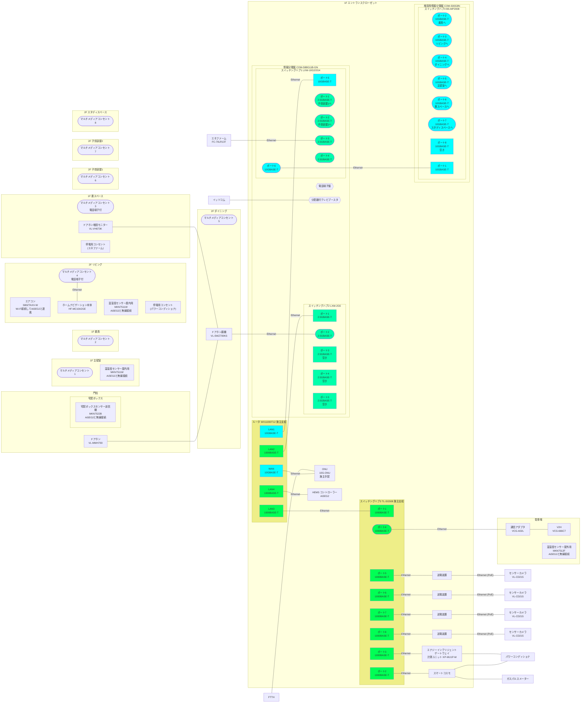

```mermaid
flowchart LR
  subgraph bedroom[1F 主寝室]
    multimediaOutlet1([マルチメディアコンセント 1])
    thermoHidrometer3["温湿度センサー屋内用\nMKN7511W\nAiSEG2と無線接続"]
  end
  subgraph dining[2F ダイニング]
    multimediaOutlet5([マルチメディアコンセント 5])
    interphoneParent[ドアホン親機\nVL-SWZ700KS]
  end
  subgraph entranceCloset[1F エントランスクローゼット]
    onu[ONU\n10G-ONU\n施主手配]
    hems[HEMS コントローラー\nAiSEG2]
    subgraph router1[ルータ WX11000T12 施主支給]
      router1wan[WAN\n10GBASE-T]
      router1lan1[LAN1\n10GBASE-T]
      router1lan2[LAN2\n1000BASE-T]
      router1lan3[LAN3\n1000BASE-T]
      router1lan4[LAN4\n1000BASE-T]
    end
    subgraph infoPanelboard[情報分電盤 COM-S88G11B-GN]
      subgraph switch2[スイッチングハブ2 LXW-2G5]
        switch2port1[ポート1\n2.5GBASE-T]
        switch2port2([ポート2\n2.5GBASE-T])
        switch2port3[ポート3\n2.5GBASE-T\n空き]
        switch2port4[ポート4\n2.5GBASE-T\n空き]
        switch2port5[ポート5\n2.5GBASE-T\n空き]
      end
      subgraph switch1[スイッチングハブ1 LXW-10G2/2G4]
        switch1port5[ポート5\n10GBASE-T]
        switch1port6([ポート6\n10GBASE-T])
        switch1port1([ポート1\n2.5GBASE-T\n子供部屋1へ])
        switch1port2([ポート2\n2.5GBASE-T\n子供部屋2へ])
        switch1port3([ポート3\n2.5GBASE-T])
        switch1port4([ポート4\n2.5GBASE-T])
      end
      telTerminal{{電話端子盤}}
      booster{{分配器付テレビブースタ}}
    end
    subgraph switch3[スイッチングハブ3 TL-SG508 施主支給]
      switch3port1[ポート1\n1000BASE-T]
      switch3port2[ポート2\n1000BASE-T]
      switch3port3[ポート3\n1000BASE-T]
      switch3port4([ポート4\n1000BASE-T])
      switch3port5[ポート5\n1000BASE-T]
      switch3port6[ポート6\n1000BASE-T]
      switch3port7[ポート7\n1000BASE-T]
      switch3port8[ポート8\n1000BASE-T]
    end
    subgraph additionalInfoPanelboard[増設用情報分電盤 COM-S00G8N]
      subgraph switch4[スイッチングハブ4 BS-MP2008]
        switch4port2([ポート2\n10GBASE-T\n書斎へ])
        switch4port3([ポート3\n10GBASE-T\nリビングへ])
        switch4port4([ポート4\n10GBASE-T\nダイニングへ])
        switch4port5([ポート5\n10GBASE-T\n主寝室へ])
        switch4port6([ポート6\n10GBASE-T\n畳スペースへ])
        switch4port7([ポート7\n10GBASE-T\nスタディスペースへ])
        switch4port8[ポート8\n10GBASE-T\n空き]
        switch4port1[ポート1\n10GBASE-T]
      end
    end
    panelboard[スマートコスモ]
    poeAdapter1[送電装置]
    poeAdapter2[送電装置]
    poeAdapter3[送電装置]
    poeAdapter4[送電装置]
    energyGateway[エナジーインテリジェントゲートウェイ\n計測ユニット KP-MU1P-M]
  end
  subgraph workspace[1F 書斎]
    multimediaOutlet2([マルチメディアコンセント 2])
  end
  subgraph tatami[1F 畳スペース]
    multimediaOutlet3([マルチメディアコンセント 3\n電話端子付])
    interphoneMonitor[ドアホン増設モニター\nVL-VH673K]
    emergencyOutlet1["停電用コンセント\n(エネファーム)"]
  end
  subgraph parkingSpace[駐車場]
    v2hNetworkAdapter[通信アダプタ\nVCG-A02L] --- v2h[V2H\nVCG-666C7]
    thermoHidrometer1["温湿度センサー屋外用\nMKN7512F\nAiSEG2と無線接続"]
  end
  subgraph living[2F リビング]
    ac1[エアコン\nS80ZTAXV-W\nWi-Fi接続してAiSEG2と連携]
    thermoHidrometer2["温湿度センサー屋内用\nMKN7511W\nAiSEG2と無線接続"]
    multimediaOutlet4([マルチメディアコンセント 4\n電話端子付]) -- Ethernet --- homeNavigationServer[ホームナビゲーション本体\nHF-MC10A2GE]
    emergencyOutlet2["停電用コンセント\n(パワーコンディショナ)"]
  end
  subgraph gatepost[門柱]
    interphoneChild[ドアホン\nVL-MWH700]
    subgraph deliveryBox[宅配ボックス]
      deliveryBoxSensor[宅配ボックスセンサー送信機\nMKN7522B\nAiSEG2と無線接続]
    end
  end
  subgraph child1[2F 子供部屋1]
    multimediaOutlet6([マルチメディアコンセント 6])
  end
  subgraph child2[2F 子供部屋2]
    multimediaOutlet7([マルチメディアコンセント 7])
  end
  subgraph studyarea[2F スタディスペース]
    multimediaOutlet8([マルチメディアコンセント 8])
  end

  ftth[FTTH] --- onu
  itscom[イッツコム] ---- booster
  router1wan -- Ethernet --- onu
  router1lan1 -- Ethernet --- switch1port5
  router1lan2 -- Ethernet --- switch2port1
  router1lan3 -- Ethernet ---- switch3port1
  router1lan4 -- Ethernet --- hems
  switch1port1
  enefarm[エネファーム\nFC-70LR13T] -- Ethernet ---- switch1port3
  switch1port6 -- Ethernet ----- switch4port1
  interphoneParent -- Ethernet ---- switch2port2
  interphoneMonitor --- interphoneParent
  interphoneChild[ドアホン\nVL-MWH700] --- interphoneParent
  switch3port2 -- Ethernet --- panelboard
  switch3port3 -- Ethernet --- energyGateway
  switch3port4 -- Ethernet ---- v2hNetworkAdapter
  switch3port5 -- Ethernet --- poeAdapter1[送電装置] -- "Ethernet (PoE)" --- camera1[センサーカメラ\nVL-CD215]
  switch3port6 -- Ethernet --- poeAdapter2[送電装置] -- "Ethernet (PoE)" --- camera2[センサーカメラ\nVL-CD215]
  switch3port7 -- Ethernet --- poeAdapter3[送電装置] -- "Ethernet (PoE)" --- camera3[センサーカメラ\nVL-CD215]
  switch3port8 -- Ethernet --- poeAdapter4[送電装置] -- "Ethernet (PoE)" --- camera4[センサーカメラ\nVL-CD215]
  energyGateway --- powerConditioner
  panelboard --- powerConditioner[パワーコンディショナ]
  panelboard --- gasMeter[ガスパルスメーター]

  classDef providedByOwner fill:#ee8
  class router1,switch3 providedByOwner
  classDef oneGiga fill:#0f5
  classDef twoGiga fill:#0fa
  classDef tenGiga fill:#0ff
  class router1lan2,router1lan3,router1lan4,switch3port1,switch3port2,switch3port3,switch3port4,switch3port5,switch3port6,switch3port7,switch3port8, oneGiga
  class switch1port1,switch1port2,switch1port3,switch1port4,switch2port1,switch2port2,switch2port3,switch2port4,switch2port5 twoGiga
  class router1wan,router1lan1,switch1port5,switch1port6,switch4port1,switch4port2,switch4port3,switch4port4,switch4port5,switch4port6,switch4port7,switch4port8, tenGiga
```
