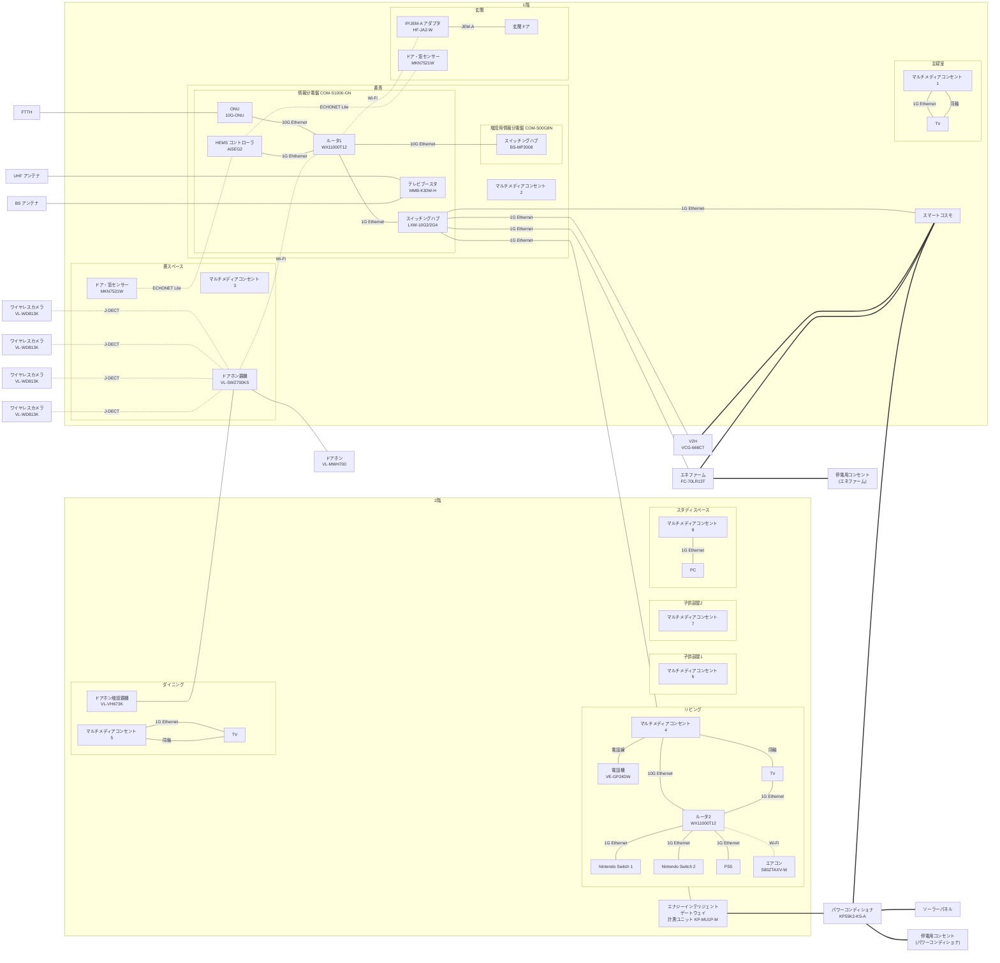

```mermaid
flowchart LR
  enefarm[エネファーム\nFC-70LR13T]
  solarpanel[ソーラーパネル]
  powerConditioner[パワーコンディショナ\nKP55K2-KS-A]
  panelboard[スマートコスモ]
  onu[ONU\n10G-ONU]
  phone[電話機\nVE-GP24DW]
  switch1[スイッチングハブ\nLXW-10G2/2G4]
  switch2[スイッチングハブ\nBS-MP2008]
  pc[PC]
  router1[ルータ1\nWX11000T12]
  router2[ルータ2\nWX11000T12]
  ps5[PS5]
  nx1[Nintendo Switch 1]
  nx2[Nintendo Switch 2]
  tv1[TV]
  tv2[TV]
  tv3[TV]
  ac1[エアコン\nS80ZTAXV-W]
  v2h[V2H\nVCG-666C7]
  hems[HEMS コントローラ\nAiSEG2]
  energyGateway[エナジーインテリジェントゲートウェイ\n計測ユニット KP-MU1P-M]
  ftth[FTTH]
  uhf[UHF アンテナ]
  bs[BS アンテナ]
  multimediaOutlet1[マルチメディアコンセント 1]
  multimediaOutlet2[マルチメディアコンセント 2]
  multimediaOutlet3[マルチメディアコンセント 3]
  multimediaOutlet4[マルチメディアコンセント 4]
  multimediaOutlet5[マルチメディアコンセント 5]
  multimediaOutlet6[マルチメディアコンセント 6]
  multimediaOutlet7[マルチメディアコンセント 7]
  multimediaOutlet8[マルチメディアコンセント 8]
  emergencyOutlet1["停電用コンセント\n(エネファーム)"]
  emergencyOutlet2["停電用コンセント\n(パワーコンディショナ)"]
  entrancedoor[玄関ドア]
  interphoneChild[ドアホン\nVL-MWH700]
  interphoneParent1[ドアホン親機\nVL-SWZ700KS]
  jema-adapter1[IP/JEM-A アダプタ\nHF-JA2-W]
  subgraph 1f[1階]
    subgraph bedroom[主寝室]
      tv3
      multimediaOutlet1
      multimediaOutlet1 -- 1G Ethernet --- tv3
      multimediaOutlet1 -- 同軸 --- tv3
    end
    subgraph workspace[書斎]
      multimediaOutlet2
      subgraph infoPanelboard[情報分電盤 COM-S1000-GN]
        booster[テレビブースタ\nMMB-K30W-H]
        onu -- 10G Ethernet --- router1
        router1 -- 1G Ethernet --- switch1
        hems -- 1G Ehthernet --- router1
      end
      subgraph additionalInfoPanelboard[増設用情報分電盤 COM-S00G8N]
        switch2
      end
      router1 -- 10G Ethernet ---- switch2
    end
    switch1 -- 1G Ethernet --- panelboard
    interphoneParent1 -. Wi-Fi .- router1
    subgraph entrnance[玄関]
      jema-adapter1 -- JEM-A --- entrancedoor
      hems -. ECHONET Lite ..- windowSensor2["ドア・窓センサー\nMKN7521W"]
    end
    subgraph tatami[畳スペース]
      multimediaOutlet3
      windowSensor1["ドア・窓センサー\nMKN7521W"]
      interphoneParent1
    end
    windowSensor1 -. ECHONET Lite .- hems
    router1 -. "Wi-Fi" .- jema-adapter1
  end

  subgraph 2f[2階]
    energyGateway
    subgraph dining[ダイニング]
      interphoneParent2[ドアホン増設親機\nVL-VH673K]
      multimediaOutlet5 -- 1G Ethernet --- tv2
      multimediaOutlet5 -- 同軸 --- tv2
    end
    subgraph living[リビング]
      multimediaOutlet4 -- 10G Ethernet --- router2
      multimediaOutlet4 -- 同軸 --- tv1
      multimediaOutlet4 -- 電話線 --- phone
      tv1 -- 1G Ethernet --- router2
      router2 -- 1G Ethernet --- nx1
      router2 -- 1G Ethernet --- nx2
      router2 -- 1G Ethernet --- ps5
      router2 -. "Wi-Fi" .- ac1
    end
    subgraph child1[子供部屋1]
      multimediaOutlet6
    end
    subgraph child2[子供部屋2]
      multimediaOutlet7
    end
    subgraph studyarea[スタディスペース]
      multimediaOutlet8 -- 1G Ethernet --- pc
    end
  end

  ftth ---- onu
  uhf ------ booster
  bs ------ booster

  %% J-DECT
  interphoneParent2 --- interphoneParent1
  interphoneParent1 --- interphoneChild

  camera1[ワイヤレスカメラ\nVL-WD813K] -. J-DECT ..-  interphoneParent1
  camera2[ワイヤレスカメラ\nVL-WD813K] -. J-DECT ..-  interphoneParent1
  camera3[ワイヤレスカメラ\nVL-WD813K] -. J-DECT ..-  interphoneParent1
  camera4[ワイヤレスカメラ\nVL-WD813K] -. J-DECT ..-  interphoneParent1

  %% HEMS
  switch1 -- 1G Ethernet ---- v2h
  switch1 -- 1G Ethernet ---- enefarm
  switch1 -- 1G Ethernet ---- energyGateway

  powerConditioner === solarpanel
  enefarm === emergencyOutlet1
  v2h ==== panelboard
  enefarm ==== panelboard
  powerConditioner === panelboard
  energyGateway === powerConditioner 
  powerConditioner === emergencyOutlet2

```
