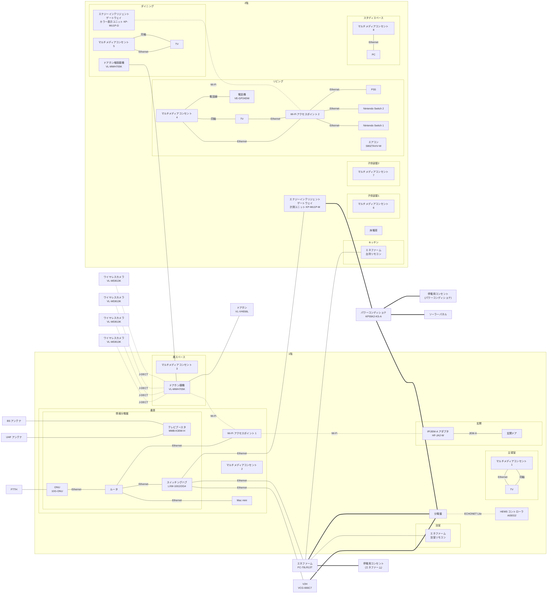

```mermaid
flowchart LR

  solarpanel[ソーラーパネル]
  powerConditioner[パワーコンディショナ\nKP55K2-KS-A]
  panelboard[分電盤]
  onu[ONU\n10G-ONU]
  router[ルータ]
  phone[電話機\nVE-GP24DW]
  switch[スイッチングハブ\nLXW-10G2/2G4]
  booster[テレビブースタ\nMMB-K30W-H]
  pc[PC]
  macmini[Mac mini]
  ap1[Wi-Fi アクセスポイント 1]
  ap2[Wi-Fi アクセスポイント 2]
  ps5[PS5]
  nx1[Nintendo Switch 1]
  nx2[Nintendo Switch 2]
  tv1[TV]
  tv2[TV]
  tv3[TV]
  ac1[エアコン\nS80ZTAXV-W]
  v2h[V2H\nVCG-666C7]
  hems[HEMS コントローラ\nAiSEG2]
  enefarm[エネファーム\nFC-70LR13T]
  enefarmKitchenController[エネファーム\n台所リモコン]
  enefarmBathController[エネファーム\n浴室リモコン]
  floorHeating[床暖房]
  energyGateway[エナジーインテリジェントゲートウェイ\n計測ユニット KP-MU1P-M]
  energyGatewayDisplay[エナジーインテリジェントゲートウェイ\nカラー表示ユニット KP-MU1P-D]
  ftth[FTTH]
  uhf[UHF アンテナ]
  bs[BS アンテナ]
  multimediaOutlet1[マルチメディアコンセント 1]
  multimediaOutlet2[マルチメディアコンセント 2]
  multimediaOutlet3[マルチメディアコンセント 3]
  multimediaOutlet4[マルチメディアコンセント 4]
  multimediaOutlet5[マルチメディアコンセント 5]
  multimediaOutlet6[マルチメディアコンセント 6]
  multimediaOutlet7[マルチメディアコンセント 7]
  multimediaOutlet8[マルチメディアコンセント 8]
  emergencyOutlet1["停電用コンセント\n(エネファーム)"]
  emergencyOutlet2["停電用コンセント\n(パワーコンディショナ)"]
  entrancedoor[玄関ドア]
  interphoneChild[ドアホン\nVL-VH556L]
  interphoneParent1[ドアホン親機\nVL-MWH705K]
  interphoneParent2[ドアホン増設親機\nVL-MWH705K]
  jema-adapter1[IP/JEM-A アダプタ\nHF-JA2-W]
  camera1[ワイヤレスカメラ\nVL-WD813K]
  camera2[ワイヤレスカメラ\nVL-WD813K]
  camera3[ワイヤレスカメラ\nVL-WD813K]
  camera4[ワイヤレスカメラ\nVL-WD813K]

  subgraph 1f[1階]
    subgraph bedroom[主寝室]
      tv3
      multimediaOutlet1
      multimediaOutlet1 -- Ethernet --- tv3
      multimediaOutlet1 -- 同軸 --- tv3
    end
    subgraph workspace[書斎]
      multimediaOutlet2
      router -- Ethernet ---- macmini
      subgraph infopanelboard[情報分電盤]
        booster
        onu -- Ethernet --- router
        router -- Ethernet --- switch
      end
      router -- Ethernet ---- ap1
    end
    subgraph entrnance[玄関]
      jema-adapter1 -- JEM-A --- entrancedoor
    end
    subgraph tatami[畳スペース]
      multimediaOutlet3
      interphoneParent1
    end
    subgraph bath[浴室]
      enefarmBathController
    end

    panelboard -. ECHONET Lite .- hems

    interphoneParent1 -. Wi-Fi .- ap1
    ap1 -...-|Wi-Fi|jema-adapter1
  end

  subgraph 2f[2階]
    energyGateway
    floorHeating
    subgraph child1[子供部屋1]
      multimediaOutlet6
    end
    subgraph child2[子供部屋2]
      multimediaOutlet7
    end
    subgraph living[リビング]
      multimediaOutlet4 -- Ethernet --- ap2
      multimediaOutlet4 -- 同軸 --- tv1
      multimediaOutlet4 -- 電話線 --- phone
      tv1 -- Ethernet --- ap2
      ap2 -- Ethernet --- nx1
      ap2 -- Ethernet --- nx2
      ap2 -- Ethernet --- ps5
      ac1
    end
    subgraph dining[ダイニング]
      interphoneParent2
      energyGatewayDisplay-...-|Wi-Fi|ap2
      multimediaOutlet5 -- Ethernet --- tv2
      multimediaOutlet5 -- 同軸 --- tv2
    end
    subgraph kitchen[キッチン]
      enefarmKitchenController
    end
    subgraph studyarea[スタディスペース]
      multimediaOutlet8 -- Ethernet --- pc
    end
  end


  ftth --- onu
  uhf ----- booster
  bs ----- booster

  %% J-DECT
  interphoneParent2 --- interphoneParent1
  interphoneParent1 --- interphoneChild

  camera1 -. J-DECT .-  interphoneParent1
  camera2 -. J-DECT .-  interphoneParent1
  camera3 -. J-DECT .-  interphoneParent1
  camera4 -. J-DECT .-  interphoneParent1

  %% HEMS
  switch -- Ethernet --- v2h
  switch -- Ethernet ---- enefarm
  switch -- Ethernet ---- energyGateway

  enefarm ---- enefarmBathController
  enefarm --- enefarmKitchenController
  powerConditioner === solarpanel
  enefarm === panelboard
  enefarm === emergencyOutlet1
  v2h ==== panelboard
  powerConditioner === panelboard
  energyGateway === powerConditioner 
  powerConditioner === emergencyOutlet2

```

# 確認事項

## パワーコンディショナ
* "HEMS モニタを使用する場合は計測ユニットセットを選択します"
* 非常コンセント

## エネファーム
* 非常コンセント
* 停電時発電再開用外部電源
