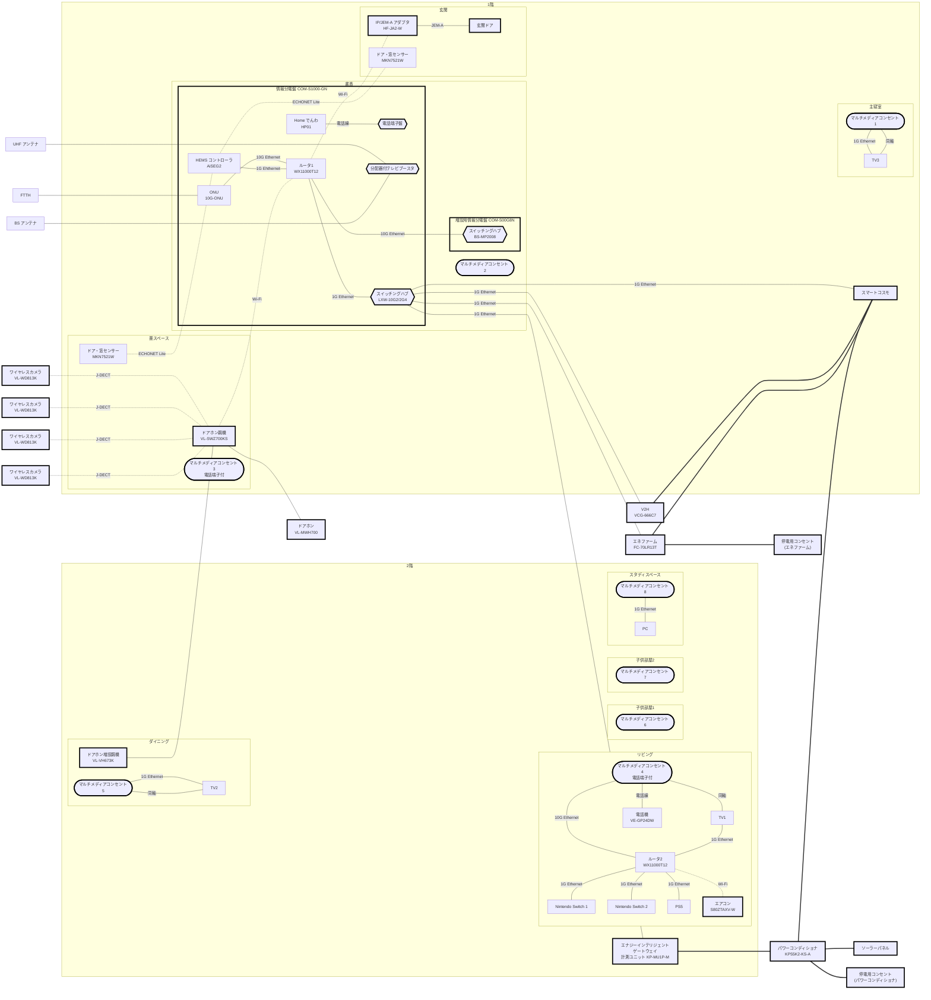

```mermaid
flowchart LR
  subgraph 1f[1階]
    subgraph bedroom[主寝室]
      tv3[TV3]
      multimediaOutlet1([マルチメディアコンセント 1])
      multimediaOutlet1 -- 1G Ethernet --- tv3
      multimediaOutlet1 -- 同軸 --- tv3
    end
    subgraph workspace[書斎]
      multimediaOutlet2([マルチメディアコンセント 2])
      subgraph infoPanelboard[情報分電盤 COM-S1000-GN]
        homeDenwa[Home でんわ\nHP01] -- 電話線 --- telTerminal{{電話端子盤}}
        booster{{分配器付テレビブースタ}}
        onu[ONU\n10G-ONU] -- 10G Ethernet --- router1[ルータ1\nWX11000T12]
        hems[HEMS コントローラ\nAiSEG2] -- 1G Ehthernet --- router1 -- 1G Ethernet --- switch1{{スイッチングハブ\nLXW-10G2/2G4}}
      end
      subgraph additionalInfoPanelboard[増設用情報分電盤 COM-S00G8N]
        switch2{{スイッチングハブ\nBS-MP2008}}
      end
      router1 -- 10G Ethernet ---- switch2
    end
    switch1 -- 1G Ethernet --- panelboard[スマートコスモ]
    interphoneParent1[ドアホン親機\nVL-SWZ700KS] -. Wi-Fi .- router1
    subgraph entrnance[玄関]
      jema-adapter1 -- JEM-A --- entranceDoor[玄関ドア]
      hems -. ECHONET Lite ..- windowSensor2["ドア・窓センサー\nMKN7521W"]
    end
    subgraph tatami[畳スペース]
      multimediaOutlet3([マルチメディアコンセント 3\n電話端子付])
      windowSensor1["ドア・窓センサー\nMKN7521W"]
      interphoneParent1
    end
    windowSensor1 -. ECHONET Lite .- hems
    router1 -. "Wi-Fi" .- jema-adapter1[IP/JEM-A アダプタ\nHF-JA2-W]
  end

  subgraph 2f[2階]
    energyGateway[エナジーインテリジェントゲートウェイ\n計測ユニット KP-MU1P-M]
    subgraph dining[ダイニング]
      interphoneParent2[ドアホン増設親機\nVL-VH673K]
      multimediaOutlet5([マルチメディアコンセント 5]) -- 1G Ethernet --- tv2[TV2]
      multimediaOutlet5 -- 同軸 --- tv2
    end
    subgraph living[リビング]
      multimediaOutlet4([マルチメディアコンセント 4\n電話端子付]) -- 10G Ethernet --- router2[ルータ2\nWX11000T12]
      multimediaOutlet4 -- 同軸 --- tv1[TV1]
      multimediaOutlet4 -- 電話線 --- phone[電話機\nVE-GP24DW]
      tv1 -- 1G Ethernet --- router2
      router2 -- 1G Ethernet --- nx1[Nintendo Switch 1]
      router2 -- 1G Ethernet --- nx2[Nintendo Switch 2]
      router2 -- 1G Ethernet --- ps5[PS5]
      router2 -. "Wi-Fi" .- ac1[エアコン\nS80ZTAXV-W]
    end
    subgraph child1[子供部屋1]
      multimediaOutlet6([マルチメディアコンセント 6])
    end
    subgraph child2[子供部屋2]
      multimediaOutlet7([マルチメディアコンセント 7])
    end
    subgraph studyarea[スタディスペース]
      multimediaOutlet8([マルチメディアコンセント 8]) -- 1G Ethernet --- pc[PC]
    end
  end

  ftth[FTTH] ---- onu
  uhf[UHF アンテナ] ------ booster
  bs[BS アンテナ] ------ booster
  interphoneParent2 --- interphoneParent1 --- interphoneChild[ドアホン\nVL-MWH700]
  camera1[ワイヤレスカメラ\nVL-WD813K] -. J-DECT ..-  interphoneParent1
  camera2[ワイヤレスカメラ\nVL-WD813K] -. J-DECT ..-  interphoneParent1
  camera3[ワイヤレスカメラ\nVL-WD813K] -. J-DECT ..-  interphoneParent1
  camera4[ワイヤレスカメラ\nVL-WD813K] -. J-DECT ..-  interphoneParent1
  switch1 -- 1G Ethernet ---- v2h[V2H\nVCG-666C7] ==== panelboard
  switch1 -- 1G Ethernet ---- enefarm[エネファーム\nFC-70LR13T] === emergencyOutlet1["停電用コンセント\n(エネファーム)"]
  switch1 -- 1G Ethernet ---- energyGateway === powerConditioner  === panelboard
  powerConditioner[パワーコンディショナ\nKP55K2-KS-A] === solarPanel[ソーラーパネル]
  enefarm ==== panelboard
  powerConditioner === emergencyOutlet2["停電用コンセント\n(パワーコンディショナ)"]

  classDef fixed stroke-width:4px,stroke:#000
  class multimediaOutlet1,multimediaOutlet2,multimediaOutlet3,multimediaOutlet4,multimediaOutlet5,multimediaOutlet6,multimediaOutlet7,multimediaOutlet8 fixed
  class v2h,enefarm,emergencyOutlet1,emergencyOutlet2,solarPanel,powerConditioner,energyGateway,interphoneParent1,interphoneParent2,interphoneChild,ac1 fixed
  class camera1,camera2,camera3,camera4,jema-adapter1,entranceDoor,panelboard,infoPanelboard,additionalInfoPanelboard,switch1,switch2,booster,telTerminal fixed
```
